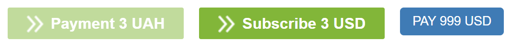

# react-liqpay

> React component for LiqPay payment system

[](https://www.npmjs.com/package/react-liqpay) [](https://standardjs.com)

## Install

```bash
yarn add react-liqpay
```

or

```bash
npm install --save react-liqpay
```

## Usage

```jsx
import React, { Component } from "react";

import { LiqPayPay, LiqPaySubscribe } from "react-liqpay";

class Example extends Component {
  const payInfo = {
    amount: 999,
    currency: 'USD',
    title: 'PAY'
  }

  const ButtonComponent = () => (
    <button style={{
      backgroundColor: '#337ab7',
      color: '#fff',
      borderColor: '#2e6da4',
      border: '1px solid transparent',
      borderRadius: '4px',
      padding: '6px 12px',
      cursor: 'pointer'
    }}>
      {`${payInfo.title} ${payInfo.amount} ${payInfo.currency}`}
    </button>
  )

  render() {
    return (
      <div style={{ display: "flex" }}>
        <LiqPayPay
          publicKey={process.env.REACT_APP_PUBLIC_KEY}
          privateKey={process.env.REACT_APP_PRIVATE_KEY}
          amount="3"
          description="Payment for product"
          currency="UAH"
          orderId={Math.floor(1 + Math.random() * 900000000)}
          result_url="http://domain.com/user/account"
          server_url="http://server.domain.com/liqpay"
          product_description="Online courses"
          style={{ margin: "8px" }}
          disabled={true}
        />
        <LiqPaySubscribe
          publicKey={process.env.REACT_APP_PUBLIC_KEY}
          privateKey={process.env.REACT_APP_PRIVATE_KEY}
          amount="3"
          subscribePeriodicity="month"
          description="Payment for subscription"
          currency="USD"
          orderId={Math.floor(1 + Math.random() * 900000000)}
          result_url="http://domain.com/user/account"
          server_url="http://server.domain.com/liqpay"
          product_description="Online courses"
          style={{ margin: "8px" }}
          disabled={false}
        />
        <LiqPayPay
          publicKey={process.env.REACT_APP_PUBLIC_KEY}
          privateKey={process.env.REACT_APP_PRIVATE_KEY}
          amount="3"
          description="Payment for product"
          currency="UAH"
          orderId={Math.floor(1 + Math.random() * 900000000)}
          result_url="http://domain.com/user/account"
          server_url="http://server.domain.com/liqpay"
          product_description="Online courses"
          style={{ margin: "8px" }}
          extra={<ButtonComponent key="1" />}
        />
      </div>
    );
  }
}
```



### common props

- `publicKey` - **String** Public key - the store identifier. You can get the key in the [store settings](https://www.liqpay.ua/en/adminbusiness)
- `privateKey`- **String** Private key of the created company (not available to anyone except your developer)
- `amount` - **String** Payment amount. For example: `5`, `7.34`
- `description` - **String** Payment description. _(default "test")_
- `currency` - **String** Payment currency. Possible values: `USD`, `EUR`, `RUB`, `UAH`, `BYN`, `KZT`. Additional currencies can be added by company's request.
- `orderId` - **String** Unique purchase ID in your shop. Maximum length is 255 symbols.
- `result_url` - **String** URL of your shop where the buyer would be redirected after completion of the purchase. Maximum length 510 symbols.
- `server_url` - **String** URL API in your store for notifications of payment status change (`server->server`). Maximum length is 510 symbols. [Learn more](https://www.liqpay.ua/documentation/en/api/callback)
- `style` - **Object** Styles for component, like '`margin`'
- `disabled` - **Boolean** Props for disabling component. _(default "false")_
- `extra` - **Object** Extra component for rendering as main component _(default "null")_

### LiqPayPay props

- `title` - **String** Text showing as main text inside button. _(default "Payment")_

### LiqPaySubscribe props

- `title` - **String** Text showing as main text inside button. _(default "Subscribe")_

- `subscribePeriodicity` - **String** Period of payments.

  Possible values: `month` - once in a month, `year` - once in a year _(default "month")_

## CHANGELOG

- v1.0.0
  - initial commit
  - functional buttons with two payment actions:
    - 'pay'
    - 'subscribe'
  - example
- v1.1.0
  - example to readme
  - component picture
  - additional props in component - can pass 'style', 'result_url', 'server_url', 'product_description' etc...
  - change base64 function - support cyrillic characters
  - costume title for button
- v1.2.0
  - packages upgrade
- v1.2.1
  - typos correction
- v1.3.0
  - custom component - you can pass your own component as 'extra' props
  - refactoring
  - fixing PropTypes
  - 'disabled' props for components buttons
  - props descriptions
  - update component picture
  - updated example
- v1.4.0
  - update README.md
  - upgrade react peer dependency version to 18.0.0
  - added typechecking

## License

MIT © [alexneo2003](https://github.com/alexneo2003)
